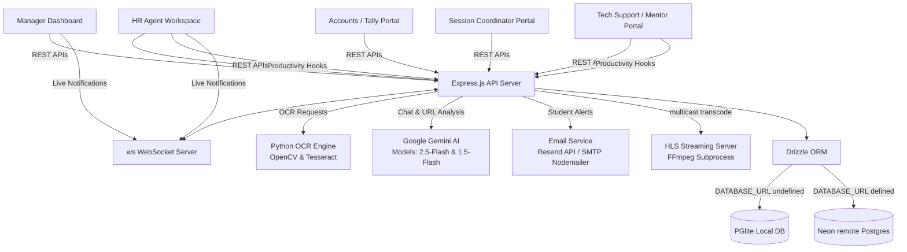
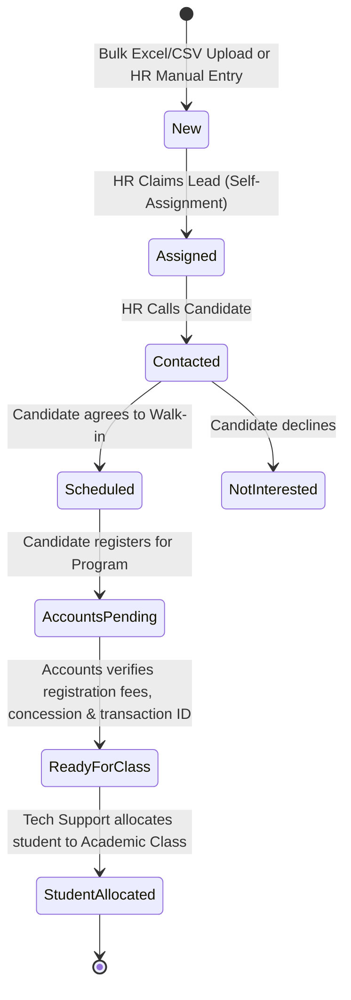
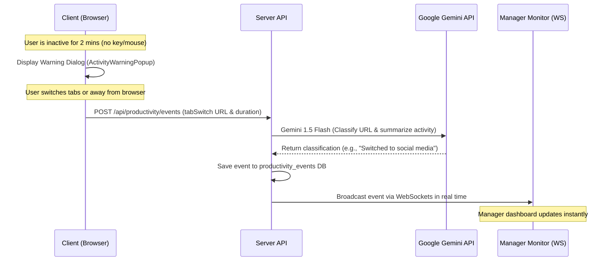

# About VHOMIFY - Advanced AI-Powered Lead & CRM Portal

VHOMIFY is a state-of-the-art, full-stack Human Resources and Customer Relationship Management (CRM) platform designed to automate lead pipelines, track candidate profiles via OCR, monitor employee productivity, coordinate academic classes, and provide AI-assisted workflows. 

Built with a modular, role-based architecture, VHOMIFY manages the entire lifecycle of a candidate from initial lead capture to class registration, daily attendance, academic grading, and automatic notifications.

---

## 🗺️ System Architecture Overview

---

## 🛠️ Complete Technology Stack

VHOMIFY utilizes a modern, robust, and highly optimized stack across both client and server layers.

### 1. Frontend (Client-Side)
*   **Core UI Library:** **React 18.3.1** (Single Page Application)
*   **Programming Language:** **TypeScript 5.6.3** for strict compile-time type-safety.
*   **Build Tool & Dev Server:** **Vite 5.4.20** providing fast Hot Module Replacement (HMR).
*   **Routing:** **Wouter 3.3.5** for high-performance, lightweight client-side routing.
*   **State Management & Caching:** **TanStack Query (React Query) v5** for efficient server-state caching, automatic refetching, and pagination.
*   **Styling:** **Tailwind CSS** combined with `class-variance-authority` and `tailwind-merge` for responsive utility-first layout styling.
*   **Component Library:** **Shadcn UI** built over **Radix UI Primitives** (Accordion, Dialog, Tabs, Dropdown Menu, Switch, Tooltip, Toast, Select, Progress, etc.).
*   **Form Handling:** **React Hook Form** with **Zod** schema resolver for comprehensive client-side form validation.
*   **Data Visualization:** **Recharts** and **Chart.js** for managers' interactive metrics, sales funnels, and performance graphs.
*   **Micro-Animations:** **Framer Motion** combined with `tailwindcss-animate` for polished hover effects and component transitions.
*   **Video Player:** Dynamic loading of **HLS.js** for real-time monitoring of multicast CCTV camera streams.

### 2. Backend (Server-Side)
*   **Runtime:** **Node.js (v20.x+)**
*   **Application Server:** **Express.js (v4.21.2)**
*   **Languages:** **TypeScript** executed in development via `tsx` and bundled for production via `esbuild`.
*   **Real-time Communication:** **ws (WebSocket Server)** for broadcasting lead status changes, bulk uploads, and live agent activity alerts.
*   **Authentication & Security:** 
    *   *OAuth (Primary):* **OpenID Connect (OIDC)** client integration (`openid-client` v6) coupled with Passport.js for SSO (Replit Auth).
    *   *Credential-Based (Local/Fallback):* Session cookies (`express-session` with memory store or postgres-backed `connect-pg-simple`), with passwords encrypted using **bcrypt**.
*   **Email Notification Subsystem:** **Nodemailer** integrated with the **Resend API** (RESTful endpoints, prioritized for cloud environments that block SMTP) and standard **SMTP** as a local fallback.

### 3. Database Layer
*   **Object-Relational Mapper (ORM):** **Drizzle ORM (v0.39.3)** paired with `drizzle-zod` for unified database schema and runtime validation declarations.
*   **Database Engines (Dual-Mode):**
    *   *Local Development:* **PGlite** (`@electric-sql/pglite` v0.3.14) – a WASM-compiled, local persistent Postgres instance stored under the `./.pglite` directory, allowing the server to run locally without a separate DB container.
    *   *Production Cloud:* **Neon Serverless PostgreSQL Database** connected via the standard `pg` (node-postgres) driver when the `DATABASE_URL` environment variable is defined.

### 4. AI & OCR Processing Engines
*   **Generative AI Integration:** **`@google/generative-ai` (v0.24.1)** SDK.
    *   *Model `gemini-2.5-flash`:* Drives the floating chatbot assistant, answering questions and saving transcripts.
    *   *Model `gemini-1.5-flash`:* Processes employee tab switch logs by generating brief labels of active domains and classifying durations.
*   **OCR & Image Extraction Pipeline:**
    *   **OpenCV (`opencv-python`):** Image preprocessing, resolution scaling, noise reduction, and contrast enhancement.
    *   **Tesseract OCR (`pytesseract`):** Scans candidate profile screenshots to extract raw unicode text.
    *   **Regex / Tokenizer Script (`extract_resume.py`):** Categorizes profiles (Naukri vs. Shine), filters UI text, handles missing values (marked as `nil`), and parses names, contact info, locations, degrees, and universities.

### 5. Media Streaming Engine
*   **Live Stream Transcoder:** **FFmpeg** executed as a background subprocess (`spawn`).
*   **Functionality:** Translates multicast protocol video feeds (UDP, RTP, RTSP, HTTP MJPEG) into HLS (HTTP Live Streaming) segments stored in `/tmp/hls-segments` to enable browser-based security/training monitoring.

---

## 🔄 Core Workflows & Workings

### 1. Lead Processing & Lifecycle Pipeline

#### Detailed Stages:
1.  **Lead Intake & De-duplication:**
    *   Managers bulk-upload candidate sheets. The backend performs a batch search (`checkEmailExistsBatch`) to filter existing emails instantly.
    *   Alternately, Managers can upload candidate profile screenshots. The Python OCR script extracts details, identifies the platform (Naukri/Shine), handles missing data (defaulting email/college to `"nil"` on Shine profiles), and structures them into JSON format for review before insertion.
2.  **HR Action & Status updates:**
    *   Unassigned leads sit in the main pool. HR agents claim leads (writing audit history to prevent double-claiming).
    *   HR calls candidates, schedules Walk-in dates/times, and writes follow-up notes.
3.  **Accounts & Tally Verification:**
    *   When a candidate pays their registration fee, they enter the `accounts_pending` stage.
    *   Accounts staff review financial parameters: Base tuition (Default `7000.00`), concessions, registration payment, partial payment, pending dues, and bank transaction reference numbers.
    *   Once verified, the student is marked as `ready_for_class`.
4.  **Academic Class Allocation:**
    *   Tech Support Mentors see leads marked as `ready_for_class`. They create classes (subject, mode, mentor email) and allocate students, automatically assigning a serialized Student ID (e.g. `Subject-01`).

---

### 2. Employee Productivity Monitoring

To maintain accountability, VHOMIFY implements a non-intrusive background activity tracker for HR and Tech Support roles.

*   **Idle Tracker:** Detects keyboard/mouse idle warnings, long key presses, and tab switches. Shows a modal warning to the user.
*   **Gemini URL Categorization:** When an employee switches tabs, the backend queries Gemini to summarize the URL and duration (e.g. "Switched to video platform" or "Switched to email editor") to keep logs readable.
*   **Live Monitor:** The manager's page establishes a WebSocket connection. Activity events (e.g., active, idle, offline) are broadcasted instantly, rendering real-time statuses of all active HR and support personnel.

---

### 3. AI Chatbot Widget (Floating Assistant)
*   **Floating Panel:** HR staff can click the chatbot widget at the bottom right of their screen to request quick assistance.
*   **Integration:** Communicates with the `gemini-2.5-flash` model, utilizing a system prompt instructing the model to act as the "VHomofi HRM Assistant powered by VCodez".
*   **Audit Review:** For security and quality control, every chat conversation is saved to the database. Managers can search the transcripts or delete outdated logs.

---

### 4. Classroom Management, Attendance, and Email Alerts
*   **Attendance Tracking:** Mentors mark student attendance (`Present` or `Absent`) daily.
*   **Absence Email Notification:** If a student is absent, the system queries the class config and user's SMTP setup (or Resend API fallback). It automatically drafts and delivers an email notification to the student alerting them of their absence.
*   **Grading Matrix:** Supports recording continuous evaluation grades for:
    *   Assessment 1 (0-10)
    *   Assessment 2 (0-10)
    *   Weekly Tasks (0-10)
    *   Term Project (0-10)
    *   Final Validation (0-10)
    *   *Total Score (0-50)* (Automatically recalculated in the database storage layer)

---

### 5. Internal Social Feed ("Kathaipom")
*   **Workplace Engagement:** An internal social network page (called "Kathaipom" meaning *Let's Chat*) where employees share posts, upload photos, comment on colleague logs, and like/dislike posts, helping teams stay integrated and collaborative.

---

### 6. CCTV Streaming Server
*   **Live Surveillance:** The manager's dashboard hosts a dynamic CCTV player tab.
*   **FFmpeg Transcoding:** Spawns a background worker to capture office network IP camera feeds (RTSP/UDP/HTTP streams) and segment them as HLS formats.
*   **Dynamic rendering:** Uses `hls.js` on the browser to display the live feed seamlessly.

---

## 🔒 Security Measures
1.  **Role-Based Access Control (RBAC):** Every API endpoint validates the session role claims (`sub`, `role`) before executing DB writes.
2.  **Audit History logging:** Every modification to lead ownership, financial allocations, or status changes creates a permanent entry in the `lead_history` log.
3.  **Encrypted Credentials:** Passwords stored locally are hashed using `bcrypt`.
4.  **Database Protection:** Parametrized SQL queries generated by Drizzle ORM prevent SQL injection vulnerabilities.
